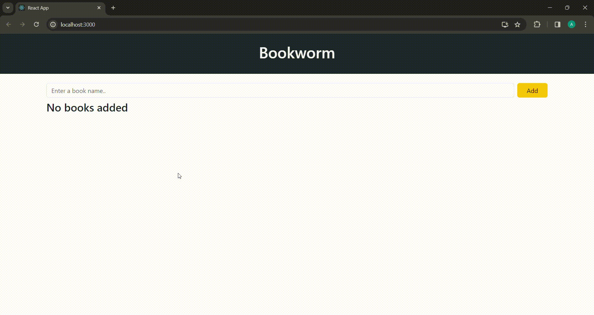

<h1>Create Read Update Delete App</h1>

This project includes a CRUD application using React. Users can create books, rename books, mark books as read, and delete books.

<h2>Used Technologies</h2>

<ul>

<li>React</li>
<li>JavaScript</li>
<li>React-Toastify</li>
<li>uuid</li>

</ul>

<h1>Screen Gif</h1>

